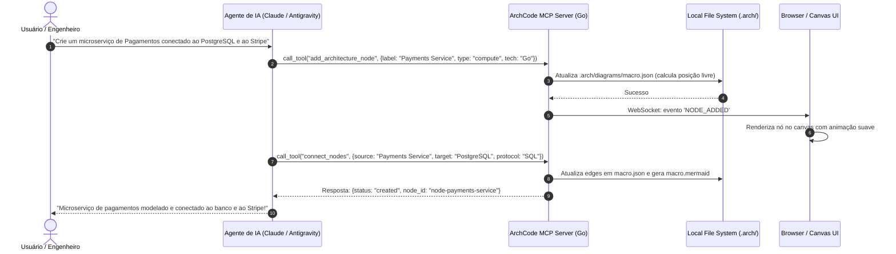
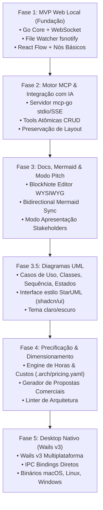

# Product Requirements Document (PRD)
## Produto: ArchCode Studio (Nome Provisório)

> **Versão:** 1.0.0  
> **Status:** Aprovado para Arquitetura & Implementação  
> **Formato:** Arquitetura-como-Código (Architecture-as-Code), Local-First, Orientado a Agentes de IA (MCP)  
> **Repositório:** `archcode-studio`

---

## 1. Sumário Executivo & Visão do Produto

### 1.1 Declaração de Visão
O **ArchCode Studio** é uma plataforma open-source, local-first e auto-hospedada (self-hosted) concebida para projetar, documentar, estimar e gerir arquiteturas de software modernas com sincronização bidirecional em tempo real entre **humanos (interface visual Drag-and-Drop)** e **Agentes de IA (via Model Context Protocol - MCP)**.

A plataforma unifica quatro pilares críticos do ciclo de vida de desenvolvimento:
1. **Comunicação com Stakeholders e Clientes:** Apresentações visuais interativas, elegantes e compreensíveis de arquiteturas de sistemas para alinhamento de escopo e vendas.
2. **Engenharia de Software Escalável e Manutenível:** Topologia técnica rigorosa com rastreabilidade direta entre requisitos de negócio, casos de uso, contratos de API e componentes de infraestrutura.
3. **Colaboração Nativa com Agentes de IA:** Uma camada MCP embutida que permite a IAs (Claude Code, Antigravity, Cursor, Roo Code, CrewAI) lerem e modificarem o sistema de forma atômica e determinística, sem corrupção de layout visual ou perda de contexto.
4. **Dimensionamento e Precificação Automatizada:** Cálculo de complexidade ciclomática de nós/arestas, estimativa de horas de desenvolvimento e custo aproximado de infraestrutura (Cloud TCO), auxiliando na formulação rápida de propostas comerciais.

```mermaid
flowchart LR
    subgraph HumanInput["👤 Humano (Browser / Desktop)"]
        UI["React Flow Canvas"]
        DocEditor["BlockNote / TipTap Docs"]
        PitchView["Apresentação & Precificação"]
    end

    subgraph CoreEngine["⚡ Go Core Engine (Executável / Wails)"]
        WS["WebSocket Server"]
        Watcher["File Watcher (fsnotify)"]
        LayoutEng["Layout & Diff Engine"]
        MCPServer["Servidor MCP (stdio / SSE)"]
        PricingEng["Pricing & Sizing Engine"]
    end

    subgraph Storage["💾 Single Source of Truth (.arch / Git)"]
        Manifest[".arch/manifest.yaml"]
        Diagrams[".arch/diagrams/macro.json & .mermaid"]
        Docs["docs/requisitos.md & casos-de-uso/"]
        APISpec["api/endpoints.yaml"]
        PricingSpec[".arch/pricing.yaml"]
    end

    subgraph AIAgents["🤖 Agentes de IA (MCP Clients)"]
        Claude["Claude Code / CLI"]
        Antigravity["Antigravity / Cursor"]
        Autonomous["CrewAI / LangGraph"]
    end

    HumanInput <-->|HTTP / WebSocket / IPC| CoreEngine
    CoreEngine <-->|Read / Write Determinístico| Storage
    AIAgents <-->|MCP Protocol (Tools & Prompts)| MCPServer
```

---

## 2. Objetivos de Negócio e Casos de Uso

### 2.1 Objetivos de Negócio
- **Zero Lock-in & Git-Friendly:** Eliminar ferramentas proprietárias e silos em nuvem (Miro, Confluence, Lucidchart). Todos os diagramas e requisitos residem na árvore de ficheiros do projeto sob controle de versão Git.
- **Aceleração da Codificação com IAs:** Eliminar alucinações de contexto de LLMs ao fornecer ferramentas MCP de alto nível que entregam o diagrama macro, requisitos vigentes e contratos de API sob demanda.
- **Apresentações de Alto Impacto para Clientes:** Fornecer um modo "Pitch/Apresentação" que transforma a topologia técnica em um fluxo visual executivo para clientes e investidores sem necessidade de retrabalho manual.
- **Redução do Tempo de Precificação de Projetos:** Permitir que agências, consultorias e engenheiros seniores estimem o esforço de entrega em minutos com base no grafo de componentes e nós de requisitos.

### 2.2 Personas de Usuário

| Persona | Desafios Atuais | Como o ArchCode Studio Resolve |
| :--- | :--- | :--- |
| **Arquiteto de Software / Tech Lead** | Documentação desatualizada; divergência entre diagramas e código; revisões manuais demoradas. | Diagramas geram contratos de API e Mermaid versionáveis; IA valida regras de arquitetura. |
| **Desenvolvedor / Engenheiro** | Falta de clareza nos fluxos de exceção; dificuldade de dar contexto a LLMs no terminal. | Servidor MCP integrado: a IA lê a arquitetura e implementa o código exato sem alucinações. |
| **Consultor / Dono de Software House** | Dificuldade de precificar projetos com precisão; reuniões comerciais com diagramas técnicos confusos. | Modo Pitch para clientes; calculadora de esforço e custos de infraestrutura integrada. |
| **Agente de IA Autônomo** | Modificar arquivos binários quebra diagramas visuais; falta de granularidade em prompts. | Acesso a tools atômicas via MCP (`add_architecture_node`, `connect_nodes`, etc.) com coordenadas preservadas. |

---

## 3. Pilha Tecnológica (Tech Stack)

### 3.1 Backend & Core Engine (Go)
- **Linguagem:** Go 1.23+
- **Comunicação Web:** `net/http` nativo, com `nhooyr.io/websocket` ou `gorilla/websocket`.
- **Monitoramento do File System:** `github.com/fsnotify/fsnotify` com *debounce* de eventos (300ms) para evitar re-renderizações excessivas.
- **Servidor MCP:** `github.com/mark3labs/mcp-go` suportando transporte via **stdio** (para Claude Code, Cursor) e **SSE** (Server-Sent Events para conexões remotas/HTTP).
- **Serialização:** `gopkg.in/yaml.v3` e `encoding/json`.
- **Empacotamento:** `embed.FS` nativo do Go para embutir assets compilados do frontend no binário final.

### 3.2 Frontend & UI (TypeScript & React)
- **Framework:** React 19 / Vite ou Next.js em modo Static Site Generation (`output: 'export'`).
- **Engine de Diagramação:** `@xyflow/react` (React Flow v12) com nós personalizados customizados para infraestrutura de software (Microserviço, Gateway, Banco de Dados, Cache, Queue, Cliente Web/Mobile, Terceiros).
- **Algoritmo de Layout:** `@dagrejs/dagre` ou `elkjs` para layout automático inicial sem destruição de nós manuais.
- **Editor de Documentos:** `@blocknote/core` e `@blocknote/react` (editor visual estilo Notion, com serialização direta e determinística para Markdown padrão).
- **Renderização e Suporte Mermaid:** `mermaid.js` integrado com parser bidirecional.
- **UI & Estilização:** Tailwind CSS + Shadcn/ui para design system acessível, rápido e responsivo, com tema claro e escuro.
- **Layout de Modelagem:** Organização de tela inspirada no StarUML — barra de menus, Toolbox contextual, abas de diagramas, Model Explorer, Editor de propriedades e barra de status.

### 3.3 Persistência & Modelo Local-First
- **Nenhuma base de dados externa (No SQLite / No Postgres):** O disco rígido e o repositório Git são a única fonte da verdade (*Source of Truth*).
- **Padrão de Ficheiros:** Markdown (.md) para documentação humana e de LLMs; YAML/JSON estruturado com schemas rigorosos para diagramas e metadados.

### 3.4 Packaging & Evolução Desktop
- **Fase 1 e 2:** Binário único executável em Go (ex: `./archcode-studio serve`) e Imagem Docker oficial (`ghcr.io/archcode/studio`).
- **Fase 3 e 4:** Aplicação Desktop Nativa multiplataforma (macOS Apple Silicon/Intel, Linux, Windows) empacotada com **Wails v3**.

---

## 4. Estrutura de Diretórios do Projeto (.arch State)

Ao inicializar um projeto (`archcode-studio init`), a seguinte estrutura canônica é criada na raiz do repositório:

```text
meu-projeto/
├── .arch/
│   ├── manifest.yaml             # Metadados do projeto, versão do schema, stack e autores
│   ├── pricing.yaml              # Configuração de horas, taxas horárias e custos de infraestrutura
│   └── diagrams/
│       ├── macro.json            # Coordenadas X/Y, tipos, estilos e metadata visual do canvas
│       ├── macro.mermaid         # Visualização Mermaid sincronizada automaticamente para README
│       ├── usecase/              # Diagramas UML de casos de uso (<id>.json + <id>.mermaid)
│       ├── class/                # Diagramas UML de classes / projeto
│       ├── sequence/             # Diagramas UML de sequência
│       ├── state/                # Diagramas UML de máquina de estados
│       └── er/                   # Modelagem de entidades e banco de dados
├── docs/
│   ├── requisitos.md             # Visão geral, requisitos funcionais (RFs) e não-funcionais (RNFs)
│   ├── ai-prd.md                 # PRD Compilado e Otimizado para IAs (Master Implementation Blueprint)
│   ├── casos-de-uso/
│   │   ├── cdu001-autenticacao.md
│   │   ├── cdu002-checkout.md
│   │   └── _template.md
│   └── architecture-decisions/   # Architecture Decision Records (ADRs)
│       └── adr-001-banco-vetorial.md
└── api/
    └── endpoints.yaml            # Contratos de rotas, payloads e status derivados das arestas
```

### 4.1 Schema de `.arch/manifest.yaml`
```yaml
schema_version: "1.0.0"
project_name: "E-Commerce Enterprise"
description: "Plataforma de alta escala com microserviços e checkout assíncrono"
version: "0.1.0"
authors:
  - name: "Vitor"
    role: "Lead Architect"
settings:
  diagram_engine: "react-flow"
  sync_mermaid: true
  auto_layout_on_import: false
  pricing_currency: "BRL"
```

### 4.2 Schema de `.arch/diagrams/macro.json`
```json
{
  "version": "1.0.0",
  "last_modified": "2026-09-23T02:30:00Z",
  "viewport": { "x": 100, "y": 50, "zoom": 1.2 },
  "nodes": [
    {
      "id": "node-auth-service",
      "type": "compute",
      "position": { "x": 250, "y": 180 },
      "data": {
        "label": "Auth Service",
        "technology": "Go / Gin",
        "description": "Responsável por JWT, OAuth2 e permissões RBAC",
        "tier": "backend",
        "tags": ["critical", "pci-dss"],
        "pricing": {
          "complexity": "medium",
          "estimated_hours": 32,
          "cloud_tier": "t4g.small"
        }
      }
    },
    {
      "id": "node-postgres-auth",
      "type": "database",
      "position": { "x": 250, "y": 380 },
      "data": {
        "label": "Auth PostgreSQL",
        "technology": "PostgreSQL 16",
        "tier": "database",
        "pricing": {
          "complexity": "low",
          "estimated_hours": 12,
          "cloud_tier": "db.t4g.micro"
        }
      }
    }
  ],
  "edges": [
    {
      "id": "edge-auth-to-db",
      "source": "node-auth-service",
      "target": "node-postgres-auth",
      "type": "smoothstep",
      "animated": false,
      "data": {
        "protocol": "TCP / SQL",
        "port": 5432,
        "description": "Persistência de credenciais e roles"
      }
    }
  ]
}
```

---

## 5. Requisitos Funcionais (RF)

### 5.1 Gestão de Requisitos & Documentação
- **[RF001] Editor Unificado de Requisitos:** O sistema deve disponibilizar um editor visual rich-text / markdown em blocos para redigir o documento de requisitos do sistema (`docs/requisitos.md`), sincronizando alterações em tempo real no disco.
- **[RF002] Gestão Modular de Casos de Uso:** O sistema deve permitir criar, listar e editar Casos de Uso isolados (`docs/casos-de-uso/cdu_XXX.md`), com campos padronizados: Atores, Pré-condições, Fluxo Principal, Fluxos Alternativos, Exceções e Regras de Negócio.
- **[RF003] Architecture Decision Records (ADRs):** Suporte nativo à criação e visualização de decisões arquiteturais na pasta `docs/architecture-decisions/` no padrão Nygard / MADR.

### 5.2 Motor Visual de Diagramação
- **[RF004] Canvas de Arquitetura Drag-and-Drop:** Canvas infinito com zoom, pan, grid magnet, minimapa e suporte a agrupamento em subgrafos (ex: "VPC", "Cluster Kubernetes", "SaaS Externos").
- **[RF005] Biblioteca de Nós Especializados:** Componentes visuais tipados:
  - *Compute:* Microserviços, Monólitos, Workers, Lambdas/Serverless.
  - *Data & Storage:* SQL, NoSQL, Cache Redis, S3/Object Storage.
  - *Networking:* API Gateways, Load Balancers, Reverse Proxies.
  - *Event/Messaging:* Kafka, RabbitMQ, SQS, Webhooks.
  - *Clients:* Mobile App, Web SPA, CLI, Agentes de IA externos.
- **[RF006] Modelagem de Arestas e Roteamento de APIs:** Cada conexão entre dois nós permite definir protocolo (REST, gRPC, WebSocket, SQL, AMQP), segurança (mTLS, JWT) e endpoints relacionados, alimentando automaticamente `api/endpoints.yaml`.
- **[RF007] Sincronização Bidirecional Mermaid:**
  - *Exportação Contínua:* Cada gravação de `macro.json` regenera de forma não-destrutiva o arquivo `macro.mermaid`.
  - *Importação de Código:* Capacidade de colar um snippet Mermaid C4 ou Flowchart e gerar nós posicionados automaticamente via Dagre/Elkjs.

### 5.2.1 Diagramas UML de Projeto
Além do diagrama macro de arquitetura, o projeto mantém diagramas UML editáveis no mesmo canvas, persistidos como um JSON por diagrama em `.arch/diagrams/<tipo>/` com espelho Mermaid sincronizado:
- **[RF024] Diagrama de Casos de Uso:** Atores, casos de uso, fronteira do sistema e notas; relações de associação, «include», «extend», generalização e dependência. Cada caso de uso pode apontar para sua ficha em `docs/casos-de-uso/`, e o diagrama pode ser gerado (de forma idempotente) a partir das fichas existentes.
- **[RF025] Diagrama de Classes (Projeto):** Classes, interfaces, enumerações e pacotes com atributos e operações (visibilidade, tipo, parâmetros, estáticos e abstratos); relações de associação (dirigida ou não), agregação, composição, generalização, realização e dependência, com multiplicidades e papéis nas extremidades.
- **[RF026] Diagrama de Sequência:** Linhas de vida (participante, ator, boundary, control, entity, banco de dados), mensagens ordenadas (síncrona, assíncrona, retorno, criação, destruição), auto-mensagens e fragmentos combinados (alt, opt, loop, par, break, critical, ref).
- **[RF027] Diagrama de Estados:** Estados simples e compostos com atividades `entry/do/exit`, pseudoestados (inicial, final, escolha, fork, join, histórico) e transições no formato `evento [guarda] / efeito`.
- **[RF028] Rastreabilidade entre Modelos:** Classes, linhas de vida e estados podem referenciar componentes do diagrama macro; todos os diagramas UML entram no `docs/ai-prd.md` como blocos Mermaid e no hash de integridade.
- **[RF029] Interface de Modelagem estilo StarUML:** Toolbox contextual por tipo de diagrama (escolher a forma e clicar no canvas), Model Explorer em árvore com todos os diagramas e elementos, Editor de propriedades, abas de diagramas, exportação PNG/SVG/Mermaid e tema claro/escuro seguindo o design system Shadcn/ui.

### 5.3 Apresentação Executiva & Modo Pitch (Stakeholder Presentation)
- **[RF008] Modo Apresentação Interativa:** Interface limpa sem barras de ferramentas, com slides passo a passo focando nós específicos (Storytelling de Arquitetura para clientes e diretores).
- **[RF009] Ocultação Seletiva de Detalhes:** Capacidade de alternar a visualização entre dois modos:
  - *Modo Executivo / Negócio:* Exibe apenas o fluxo de valor, clientes, gateways e serviços principais com descrições amigáveis.
  - *Modo Engenharia:* Exibe portas, variáveis de ambiente, subredes, réplicas e complexidade técnica.
- **[RF010] Exportação de Alta Resolução:** Exportação do diagrama em SVG vetorial escalável, PNG com fundo transparente ou PDF com sumário executivo integrado.

### 5.4 Módulo de Estimativa, Dimensionamento e Precificação
- **[RF011] Atribuição de Complexidade a Nós:** Cada nó e caso de uso possui atributos configuráveis de esforço (T-shirt sizing: XS, S, M, L, XL ou horas estimadas).
- **[RF012] Calculadora de Esforço de Desenvolvimento:** Cálculo automático do total de horas de desenvolvimento com base na soma dos nós, complexidade das integrações entre arestas e casos de uso vinculados.
- **[RF013] Estimativa de Custo de Nuvem (Cloud TCO):** Associação de nós a tipos de instâncias em nuvem (ex: AWS RDS, ECS Fargate, Vercel) com estimativa de custo mensal base configurada em `pricing.yaml`.
- **[RF014] Gerador de Proposta Comercial Técnica:** Exportação de um relatório em Markdown/PDF com: Escopo Visual, Resumo de Componentes, Estimativa de Homem-Hora e Proposta Orçamentária estimada.

### 5.5 Integração de IA e Servidor MCP (Model Context Protocol)
- **[RF015] Servidor MCP Embutido:** O executável Go inicia nativamente um servidor MCP em conformidade com a especificação Model Context Protocol da Anthropic, operando via `stdio` (padrão) e `sse` (opcional).
- **[RF016] Suíte de Ferramentas Atômicas para LLMs (Tools):** Exposição das seguintes funções para as IAs:
  - `get_architecture_summary`: Retorna o resumo do sistema, serviços ativos e contadores de componentes.
  - `get_full_context`: Retorna o grafo consolidado, requisitos e endpoints em formato compacto.
  - `add_architecture_node`: Insere um novo componente na arquitetura calculando uma posição inteligente (evitando sobreposição com nós existentes).
  - `connect_nodes`: Estabelece comunicação entre nós definindo protocolo, portas e endpoints.
  - `update_node_metadata`: Altera tecnologias, descrições ou atributos de precificação de um nó existente.
  - `upsert_requirement`: Insere ou edita um Requisito Funcional ou Não-Funcional em `docs/requisitos.md`.
  - `upsert_use_case`: Cria ou atualiza a ficha estruturada de um Caso de Uso.
  - `calculate_pricing_and_effort`: Executa a fórmula de estimativa e retorna a tabela orçamentária para a IA.
  - `validate_architecture_rules`: Executa linter de regras arquiteturais (ex: serviços isolados, ausência de banco de dados, falta de autenticação).
- **[RF017] Algoritmo de Preservação de Coordenadas:** Edições em lote executadas por LLMs preservam obrigatoriamente as coordenadas `(x, y)` dos nós pré-existentes, inserindo nós novos adjacentes ao seu nó de conexão mais próximo.

### 5.6 Compilador de PRD & Especificação Otimizada para IAs (AI-Ready PRD Generator)
- **[RF019] Compilador Consolidado de PRD para IAs:** O sistema deve disponibilizar um mecanismo automatizado (acionável com 1 clique na UI ou via ferramenta MCP) que varre todos os diagramas visuais (`macro.json`), rotas (`api/endpoints.yaml`), requisitos (`requisitos.md`), casos de uso (`casos-de-uso/`) e ADRs para sintetizar um documento único e hiper-estruturado: `docs/ai-prd.md`.
- **[RF020] Ordem Topológica de Implementação (Topological Task Sequencing):** A engine deve analisar o grafo de dependências entre componentes e gerar um roadmap sequencial de tarefas para as IAs (ex: 1º Migrations/Schemas de Banco -> 2º Entidades de Domínio -> 3º Serviços/Regras de Negócio -> 4º Handlers/Endpoints HTTP -> 5º Componentes de Interface -> 6º Testes E2E), garantindo que agentes de codificação (Claude Code, Cursor, Antigravity) implementem os módulos na ordem correta sem bloquear dependências.
- **[RF021] Invariantes Arquiteturais e Critérios de Aceite Verificáveis:** O PRD de IA deve traduzir as restrições da arquitetura em regras negativas e positivas estritas (ex: *"Proibido importar camada de infraestrutura no domínio"*, *"JWT obrigatório em rotas `/api/v1/private/*`"*), e converter cada caso de uso em testes de aceitação no formato Given-When-Then com comandos de validação automatizada.
- **[RF022] Rastreabilidade de Progresso da IA (Task Progress Tracker):** Cada etapa gerada no `ai-prd.md` possui um identificador único (ex: `TASK-AUTH-01`). Agentes de IA podem ler e atualizar o status dessas tarefas via MCP, refletindo visualmente no canvas do ArchCode Studio quais componentes já foram implementados no código e quais estão pendentes.

#### 5.6.1 Estrutura do Documento Gerado (`docs/ai-prd.md`)
O arquivo gerado é formatado para consumo imediato por modelos de raciocínio e agentes de terminal:

````markdown
# AI MASTER IMPLEMENTATION SPECIFICATION
> Auto-gerado pelo ArchCode Studio | Hash de Integridade: a8f9c1e | Total Tasks: 12

## 1. TECH STACK & SYSTEM INVARIANTS
- Language/Framework: Go 1.23 / Gin / PostgreSQL 16 / React 19
- Invariant 1: Camada de Domínio NUNCA importa pacotes de infraestrutura ou banco de dados.
- Invariant 2: Todos os endpoints `/api/v1/private/*` exigem middleware `RequireAuth()`.

## 2. TOPOLOGICAL IMPLEMENTATION SEQUENCE
- [ ] **TASK-001 (Data Tier):** Migrations e schemas de banco de dados
  - *Dependências:* Nenhuma
  - *Critério de Aceite:* Tabelas criadas no PostgreSQL via migrações idempotentes.
- [ ] **TASK-002 (Domain Tier):** Interfaces de repositório e entidades de domínio
  - *Dependências:* TASK-001
- [ ] **TASK-003 (Service Tier):** Lógica de negócio de autenticação e hashing de senha
  - *Dependências:* TASK-002
  - *Critério de Aceite:* Testes unitários com `go test ./internal/service -v` cobrindo cenários de sucesso e falha.
- [ ] **TASK-004 (Transport Tier):** Handlers HTTP e rotas REST
  - *Dependências:* TASK-003
  - *Contrato da API:* `POST /api/v1/auth/login` validado contra `api/endpoints.yaml`.

## 3. USE CASE ACCEPTANCE CRITERIA
### CDU001 - Autenticação
- **Given:** Usuário cadastrado com email `admin@archcode.io` e senha correta.
- **When:** Faz requisição `POST /api/v1/auth/login`.
- **Then:** Retorna HTTP 200 com payload `{"token": "<jwt>", "expires_in": 3600}`.
````

### 5.7 Sincronização em Tempo Real (File Watcher & WebSockets)
- **[RF023] Live Sync Bidirecional:**
  - Se o usuário arrasta um nó ou altera texto no browser, o backend salva no disco local em menos de 100ms.
  - Se um desenvolvedor ou uma IA edita `macro.json`, `requisitos.md` ou `ai-prd.md` via VS Code/CLI, o `fsnotify` detecta a mudança e emite um evento via WebSocket para a interface web renderizar o novo estado imediatamente sem recarregar a página.

---

## 6. Requisitos Não Funcionais (RNF)

| Identificador | Categoria | Descrição |
| :--- | :--- | :--- |
| **[RNF001]** | **Fonte da Verdade Baseada em Ficheiros** | Nenhum dado pode ser retido em memória ou banco proprietário. Todos os estados devem ser serializados em arquivos texto planos legíveis por humanos e commits Git. |
| **[RNF002]** | **Binário Único & Portabilidade Total** | O servidor Go deve embutir todo o HTML, JS e CSS do frontend (`embed.FS`). Um comando como `./archcode-studio` abre o servidor e inicia sem necessidade de instalar Node.js ou dependências externas na máquina do usuário. |
| **[RNF003]** | **Performance e Latência** | Tempo de inicialização do servidor Go inferior a 150ms. Latência de sincronização WebSocket do File Watcher inferior a 50ms para projetos com até 500 nós. |
| **[RNF004]** | **Otimização de Contexto para LLMs (Token Efficiency)** | As respostas das ferramentas MCP devem priorizar saídas enxutas e formatos compactos (sem campos nulos redundantes), consumindo no máximo 1.500 tokens para uma consulta de arquitetura média. |
| **[RNF005]** | **Desacoplamento Rigoroso para Wails v3** | O frontend React deve comunicar-se com o backend através de uma camada de abstração de transporte (Adapter Pattern: HTTP/WS no browser vs. IPC bindings no Wails v3), garantindo 100% de reuso de código na transição para app desktop nativa. |
| **[RNF006]** | **Compatibilidade Multiplataforma** | Suporte total e testado em Linux (x86_64, arm64), macOS (Intel e Apple Silicon M1/M2/M3/M4) e Windows 11. |
| **[RNF007]** | **Segurança Local-First** | Por padrão, o servidor escuta exclusivamente em `localhost:8765`. Não há tráfego de telemetria ou envio de diagramas para servidores de terceiros. |

---

## 7. Módulo de Precificação e Dimensionamento de Projetos

Para resolver a necessidade comercial de orçamentos rápidos e precisos para clientes, o sistema introduz a especificação de cálculo em `.arch/pricing.yaml`.

### 7.1 Exemplo de `.arch/pricing.yaml`
```yaml
currency: "BRL" # BRL, USD, EUR
hourly_rates:
  tech_lead: 250.00
  senior_engineer: 180.00
  pleno_engineer: 120.00
  cloud_architect: 260.00

complexity_multipliers:
  frontend_screen_simple: 8    # Horas
  frontend_screen_complex: 24
  backend_crud_endpoint: 6
  backend_complex_business: 20
  integration_external_api: 16
  database_modeling: 12
  ci_cd_pipeline: 16

risk_margin_percentage: 20 # Margem de contingência
tax_percentage: 15         # Impostos da empresa
```

### 7.2 Métricas de Cálculo Automatizadas
A engine calcula o esforço agregado através da fórmula:
$$\text{Horas Totais} = \left( \sum \text{Horas(Nós)} + \sum \text{Horas(Arestas/APIs)} + \sum \text{Horas(Casos de Uso)} \right) \times (1 + \text{Margem})$$

O relatório de saída expõe:
1. **Esforço de Desenvolvimento:** Distribuição de horas por perfil profissional.
2. **Custo Estimado de Pessoal:** Subtotal em moeda selecionada.
3. **Custo Estimado de Operação (Cloud Run / AWS / Supabase):** Custo de infraestrutura mensal projetado.
4. **Prazo de Entrega Estimado:** Projeção de cronograma com base no tamanho da equipe configurada.

---

## 8. Especificação das Ferramentas MCP (AI Agent Skills)

O servidor MCP implementa as seguintes ferramentas acessíveis por LLMs via `github.com/mark3labs/mcp-go`:



### 8.1 Catálogo de Ferramentas (MCP Tools)

#### 1. `get_system_context`
- **Descrição:** Retorna a visão macro da arquitetura, os requisitos e a lista de casos de uso sem sobrecarregar a janela de contexto.
- **Entrada:** `{ "include_pricing": boolean }`
- **Saída:** JSON compacto com estatísticas de nós, conexões e lista de requisitos pendentes.

#### 2. `add_architecture_node`
- **Descrição:** Cria um novo componente no diagrama calculando automaticamente uma posição livre e estética no canvas para não sobrepor nós existentes.
- **Entrada:**
  ```json
  {
    "label": "Payment Gateway",
    "type": "compute | database | queue | gateway | storage | external_service",
    "technology": "Go 1.23",
    "tier": "backend | frontend | data | devops",
    "description": "Processamento assíncrono de cobranças via Stripe",
    "complexity": "low | medium | high"
  }
  ```

#### 3. `connect_nodes`
- **Descrição:** Conecta dois nós existentes definindo protocolo e dados transmitidos.
- **Entrada:**
  ```json
  {
    "source_id": "node-payments",
    "target_id": "node-postgres",
    "protocol": "SQL",
    "port": 5432,
    "description": "Leitura e gravação de pedidos e assinaturas"
  }
  ```

#### 4. `upsert_requirement`
- **Descrição:** Registra ou atualiza um requisito funcional ou não-funcional no arquivo `docs/requisitos.md`.
- **Entrada:**
  ```json
  {
    "id": "RF020",
    "title": "Processamento de Pagamentos Assíncrono",
    "type": "RF | RNF",
    "description": "O sistema deve processar Webhooks do Stripe com idempotência.",
    "priority": "Alta | Média | Baixa"
  }
  ```

#### 5. `upsert_use_case`
- **Descrição:** Cria ou atualiza uma ficha de Caso de Uso em formato markdown na pasta `docs/casos-de-uso/`.
- **Entrada:**
  ```json
  {
    "code": "CDU003",
    "name": "Processar Assinatura Recorrente",
    "actor": "Cliente / Webhook Stripe",
    "pre_conditions": ["Cliente cadastrado", "Cartão válido"],
    "main_flow": ["1. Recebe webhook", "2. Valida assinatura", "3. Libera acesso"],
    "exceptions": ["Falha no cartão -> Envia e-mail de alerta"]
  }
  ```

#### 6. `calculate_project_estimate`
- **Descrição:** Calcula horas estimadas de desenvolvimento, custos de infraestrutura e valor total do projeto com base nas tabelas de preços do projeto.
- **Entrada:** `{ "contingency_margin": 0.20 }`
- **Saída:** Tabela detalhada de esforço, horas e custo total em moeda corrente.

#### 7. `generate_ai_prd`
- **Descrição:** Compila o estado do projeto (nós, arestas, endpoints, requisitos e casos de uso) e gera o documento canônico `docs/ai-prd.md` com ordem topológica e critérios de aceite.
- **Entrada:**
  ```json
  {
    "target_stack": "Go / React / PostgreSQL",
    "include_test_scenarios": true,
    "granularity": "detailed"
  }
  ```
- **Saída:** `{ "status": "generated", "file_path": "docs/ai-prd.md", "total_tasks": 18, "summary": "PRD para IA gerado com sucesso." }`

#### 7.1 Ferramentas de Diagramas UML
- `list_uml_diagrams` / `get_uml_diagram`: lista os diagramas e devolve um diagrama em JSON compacto + Mermaid.
- `create_uml_diagram`: cria um diagrama de casos de uso, classes, sequência ou estados.
- `add_uml_element` / `update_uml_element`: cria ou altera atores, casos de uso, classes (aceitando membros no formato `"+ login(email: string): Token"`), linhas de vida, estados etc.
- `add_uml_relation`: conecta elementos (origem/destino por id ou nome) com o tipo de relação adequado ao diagrama.
- `remove_uml_item`: remove um elemento (com suas relações) ou uma relação.
- `generate_use_case_diagram`: gera/sincroniza o diagrama de casos de uso a partir das fichas.
- `auto_layout_diagram`: reorganiza um diagrama UML, a arquitetura (`macro`) ou todos (`all`) para caber numa página A4 do Documento de Requisitos. Única operação que move elementos já posicionados — só a pedido do usuário ou logo após criar um diagrama do zero.

#### 8. `get_implementation_tasks`
- **Descrição:** Retorna a fila ordenada de tarefas técnicas pendentes com base no `docs/ai-prd.md` para orientar o agente de IA na codificação sequencial.
- **Entrada:** `{ "status": "pending | in_progress | completed | all" }`
- **Saída:** Lista de tarefas contendo ID, título, componente associado, dependências e critérios de aceite.

#### 9. `mark_task_status`
- **Descrição:** Permite à IA atualizar o status de uma tarefa após codificar e validar os testes, sincronizando o progresso com o canvas visual.
- **Entrada:**
  ```json
  {
    "task_id": "TASK-AUTH-01",
    "status": "completed | in_progress | blocked",
    "notes": "Testes unitários cobrindo JWT com 100% de sucesso."
  }
  ```
- **Saída:** `{ "task_id": "TASK-AUTH-01", "updated": true, "overall_progress_percentage": 65 }`

---

## 9. Plano de Execução & Roadmap de Desenvolvimento



### Fase 1: MVP Web Local (Fundação)
- [ ] Inicializar estrutura de projeto Go com `go.mod`.
- [ ] Implementar módulo `pkg/fs` para leitura/escrita atômica e segura de arquivos JSON/YAML/MD.
- [ ] Configurar monitoramento com `fsnotify` e broadcast de eventos via WebSocket.
- [ ] Configurar frontend com React, Tailwind CSS e React Flow.
- [ ] Implementar nós personalizados para Microserviço, Banco de Dados e Fila.
- [ ] Validar sincronização de arrastar nós no browser gravando em `macro.json` e edições no VS Code atualizando o browser.

### Fase 2: Motor MCP, IA & Compilador de PRD para Agentes
- [ ] Integrar biblioteca `github.com/mark3labs/mcp-go`.
- [ ] Implementar transporte `stdio` e `sse` no servidor Go.
- [ ] Escrever handlers para `get_system_context`, `add_architecture_node`, `connect_nodes`, `upsert_requirement`.
- [ ] Implementar o **Compilador de PRD para IA** (`generate_ai_prd`) que realiza a ordenação topológica dos nós e gera `docs/ai-prd.md`.
- [ ] Implementar ferramentas de progresso (`get_implementation_tasks`, `mark_task_status`).
- [ ] Criar algoritmo de posicionamento inteligente de nós para evitar sobreposição em adições feitas pela IA.
- [ ] Testar ciclo completo: IA recebe tarefa do PRD compilado, escreve código, executa testes e atualiza o canvas.

### Fase 3: Documentação, Mermaid & Modo Pitch
- [ ] Integrar BlockNote no frontend para edição rica do `docs/requisitos.md`.
- [ ] Implementar gerador Go bidirecional de `macro.json` <-> `macro.mermaid`.
- [ ] Desenvolver interface do **Modo Pitch**:
  - Zoom cinemático em componentes.
  - Alternância entre visão de negócio e visão técnica.
  - Exportação em SVG e PNG de alta resolução para propostas.
  - Botão de 1 clique para exportar/atualizar o `docs/ai-prd.md`.

### Fase 3.5: Diagramas UML & Interface de Modelagem
- [x] Modelo canônico de diagramas UML (`internal/model/uml.go`) com validação por tipo de diagrama.
- [x] Editores de Casos de Uso, Classes, Sequência e Estados no canvas, com notação UML fiel.
- [x] Espelho Mermaid por diagrama e seção *UML MODELS* no AI-PRD.
- [x] Ferramentas MCP para criação e edição atômica de diagramas UML.
- [x] Interface no estilo StarUML sobre Shadcn/ui, com tema claro e escuro.

### Fase 4: Dimensionamento, Precificação & Scaffolding
- [ ] Implementar parser e processador de `.arch/pricing.yaml`.
- [ ] Adicionar campos de complexidade de desenvolvimento e tier de nuvem aos nós visuais.
- [ ] Criar painel visual de precificação com gráfico de distribuição de custos e horas.
- [ ] Expor a tool MCP `calculate_project_estimate` para permitir que IAs elaborem propostas comerciais completas.
- [ ] Adicionar gerador de contratos iniciais (exportação de `api/endpoints.yaml` para especificação OpenAPI 3.1).

### Fase 5: Desktop Nativo com Wails v3
- [ ] Configurar bindings do Wails v3 unindo o core Go ao frontend React compilado.
- [ ] Implementar camada de abstração (IPC Service) para chamada direta de funções nativas de disco sem latência de rede.
- [ ] Configurar pipeline de build e release no GitHub Actions para empacotar binários `.dmg` (macOS), `.AppImage` (Linux) e `.exe` (Windows).

---

## 10. Diretrizes para Agentes de IA e System Prompts

Ao operar sobre um repositório gerenciado pelo ArchCode Studio, o Agente de IA deve aderir aos seguintes princípios:

1. **Nunca editar diretamente coordenadas `(x, y)` sem motivo:** Ao adicionar um nó via arquivo, posicione-o em um delta relativo a um nó vizinho (ex: `x = vizinho.x + 300`, `y = vizinho.y`).
2. **Manter a paridade entre Requisitos e Nós:** Se um novo microserviço é adicionado à arquitetura visual, certifique-se de que há pelo menos um Requisito Funcional (RF) ou Caso de Uso (CDU) que justifique sua existência.
3. **Respeitar os Contratos de API:** Ao criar uma aresta entre dois nós que represente tráfego HTTP, sempre atualize o arquivo `api/endpoints.yaml` com a rota e método correspondente.
4. **Atenção ao Custo e Complexidade:** Ao sugerir tecnologias nos nós, preencha os atributos de complexidade para que a calculadora de precificação do projeto permaneça precisa e realista.
5. **Consumir `docs/ai-prd.md` como Blueprint Mestre de Codificação:** Ao implementar o código-fonte da aplicação, a IA deve consultar `get_implementation_tasks`, seguir estritamente a ordenação topológica (banco -> entidades -> serviços -> rotas -> front), validar os critérios de aceite Given-When-Then e marcar as etapas concluídas com `mark_task_status`.

---

> *ArchCode Studio — Da Ideia à Arquitetura Escalável, Código Precificado e Validado por IAs.*
